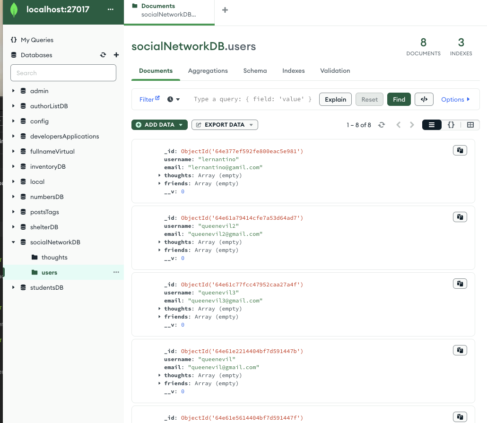
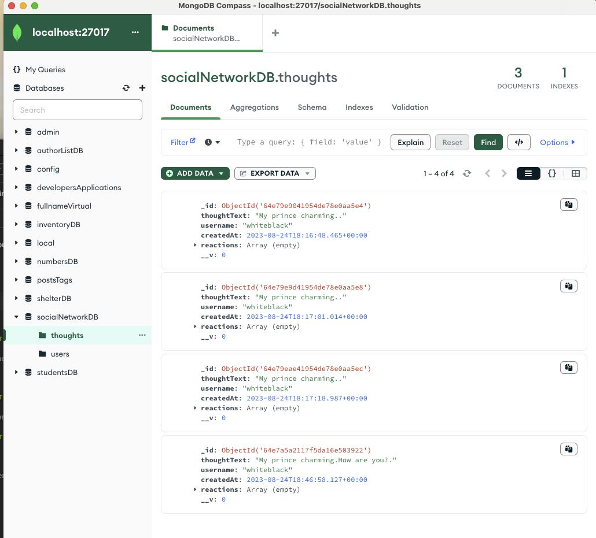

# Social-Network-API

[](https://opensource.org/licenses/MIT)

## Description.

The NoSQL Social Network API serves as a Node.js-based interface for managing social network data structures through a NoSQL database. This API empowers users to execute Create, Read, Update, and Delete (CRUD) actions on various data entities such as friends, users, thoughts, and reactions. These entities can be fetched either individually by their unique identifiers or collectively. Developed using Node.js and Mongoose, the API offers an uncomplicated and adaptable approach to managing social network data, liberating users from the confines often imposed by conventional relational databases.

## Table of Contents:
- [Overview](#Overview)
- [The Challenge](#The-Challenge)
- [Usage Information](#Usage-Information)
- [Installation Process](#Installation-Process)
- [Built With](#Built-With)
- [License](#License)
- [Author](#Author)
- [Acknowledgments](#Acknowledgments)

# Overview

## The Challenge:

The challenge was to build a RESTful API that allows a social media startup to perform CRUD operations on users, thoughts, and reactions data models using a NoSQL database. The API must be built using Node.js and Mongoose and must provide endpoints that can handle large amounts of unstructured data.

API must allow users to:

- Create and delete user accounts.
- Create, read, update, and delete thoughts.
- Add and remove reactions to thoughts.
- Add and remove friends to a user's friend list.

Test API: use Insomnia or a similar tool to send HTTP requests to the API endpoints and verify that the responses are correct.

## Assigned User Story:
```
AS A social media startup
I WANT an API for my social network that uses a NoSQL database
SO THAT my website can handle large amounts of unstructured data
```

## Acceptance Criteria:
```
GIVEN a social network API
WHEN I enter the command to invoke the application
THEN my server is started and the Mongoose models are synced to the MongoDB database
WHEN I open API GET routes in Insomnia for users and thoughts
THEN the data for each of these routes is displayed in a formatted JSON
WHEN I test API POST, PUT, and DELETE routes in Insomnia
THEN I am able to successfully create, update, and delete users and thoughts in my database
WHEN I test API POST and DELETE routes in Insomnia
THEN I am able to successfully create and delete reactions to thoughts and add and remove friends to a user’s friend list
```


## Usage Instructions:

1. Repository: Open documentation run 'npm i' and update '.env'.
2. Create a .env file in the root directory of the project and add the following variables:
3. Once the server is running, use a tool like Insomnia to test the API endpoints. 
4. Use Insomnia to test http://localhost:3001 with the following route end points API GET, POST, PUT, and DELETE routes for categories, products, and tags, ensuring successful creation, updating, and deletion of data in the database.

#### Available Endpoints:

Each endpoint must include the necessary data in the request body or URL parameters as specified in the acceptance criteria.

1. GET /api/users - get all users
2. GET /api/users/:userId - get a single user by ID
3. POST /api/users - create a new user
4. PUT /api/users/:userId - update a user by ID
5. DELETE /api/users/:userId - delete a user by ID
6. POST /api/users/:userId/friends/:friendId - add a friend to a user's friend list
7. DELETE /api/users/:userId/friends/:friendId - remove a friend from a user's friend list
8. GET /api/thought - get all thought
9. GET /api/thought/:thoughtId - get a single thought by ID
10. POST /api/thought - create a new thought
11. PUT /api/thought/:thoughtId - update a thought by ID
12. DELETE /api/thought/:thoughtId - delete a thought by ID
13. POST /api/thought/:thoughtId/reactions - add a reaction to a thought
14. DELETE /api/thought/:thoughtId/reactions/:reactionId - remove a reaction from a thought

## GitHub Repository:
[GitHub Repository:](https://github.com/jaldhara21/Social-Network-API)

## YouTube Walkthrough Video:
[Click Here to Watch]()

## MongoDB - After creating data on Insomnia, MongoDB also reflects the same data and changes that were made:





## Installation Process:
1. Clone the Repository from GitHub (or) Download Zip Folder from Repository from GitHub.
2. Open the cloned (or downloaded) repository in any source code editor.
3. Open the integrated terminal of the document and complete the respective installation guides provided in "Built With" to ensure the cloned documentation will operate.

## Built With:
- Saiyan Pride
- JSON: [JSON](https://www.npmjs.com/package/json)
- Dynamic JavaScript
- Mongoose: [7.4.3](https://www.npmjs.com/package/mongoose)
- Express.js: [4.18.2](https://www.npmjs.com/package/express)
- Node.js: [16.18.1](https://nodejs.org/en/blog/release/v16.18.1/)
- Insomnia: [by Kong](https://insomnia.rest/)
- MongoDB: [Website](https://www.mongodb.com/)
- Nodemon: [3.0.1](https://www.npmjs.com/package/nodemon/v/3.0.1)
- License Badge: [Shields.io](https://shields.io/)
- Visual Studio Code: [Website](https://code.visualstudio.com/)


## License & Copyright ©
  
[](https://opensource.org/licenses/MIT) [Open Source Initiative Link](https://opensource.org/licenses/MIT)


## Author

Follow me on Github at [jaldhara21](https://github.com/jaldhara21)! Additional questions or concerns? feel free to contact me.

Until next, bye!

© 2023 [jaldhara21](https://github.com/jaldhara21). Confidential and Proprietary. All Rights Reserved.